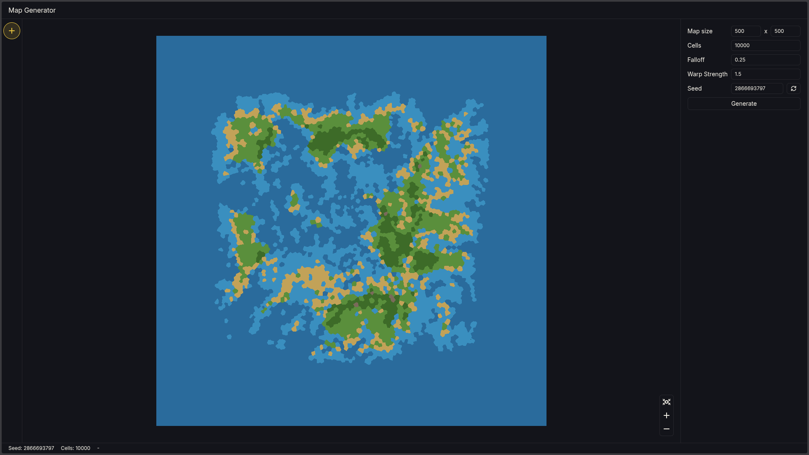

# Map Generator

A procedural world generator built with C++ and React. Built as a learning project,
it aims to make rich map generation fast and accessible without any installs.

[Open Map Generator](https://shadaeons.github.io/map-generator/)

## Tech Stack

- Emscripten (to compile C++ to WebAssembly)
- TypeScript with React and Tailwind CSS
- regl (to render the map on `<canvas>`)

## Generation process

1. Point distribution: a set of points is randomly scattered across the canvas.
2. Voronoi diagram: the plane is divided into cells using the points to form the
   base geometry of the map.
3. Lloyd relaxation: run twice to redistribute the cells more evenly.
4. Heightmap: Perlin noise with domain warping is applied to give the terrain a
   more natural-looking elevation variation.

## Credits

- Voronoi diagram library by JCash: [jc_voronoi](https://github.com/JCash/voronoi)
- Perlin noise library by Reputeless: [PerlinNoise](https://github.com/Reputeless/PerlinNoise)
